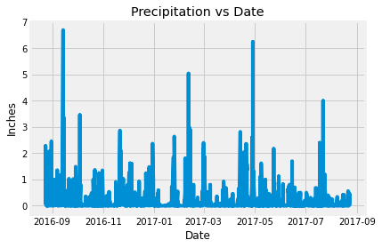
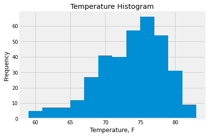
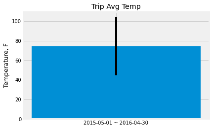
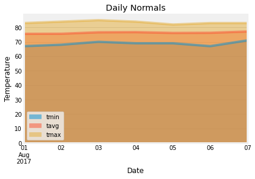

# sqlalchemy-challenge
This project is using sqlalchemy to do some climate analysis in Honolulu, Hawaii.

## 1 - Climate Analysis and Exploration

I use Python and SQLAlchemy to do basic climate analysis and data exploration of the climate database. All of the following analysis are completed using SQLAlchemy ORM queries, Pandas, and Matplotlib. I use SQLAlchemy `create_engine` to connect to hawaii sqlite database and use SQLAlchemy `automap_base()` to reflect the tables into classes and save a reference to those classes called `Station` and `Measurement`.I link Python to the database by creating an SQLAlchemy session.

### Precipitation Analysis

I start by finding the most recent date in the data set. Using this date, retrieve the last 12 months of precipitation data by querying the 12 preceding months of data. Plot the results using the DataFrame `plot` method. The summary statistics for the precipitation data is also calculated.

  

### Station Analysis

I design a query to calculate the total number of stations in the dataset.And a query to find the most active stations and calculate the lowest, highest, and average temperature  for that station.A third query is to retrieve the last 12 months of temperature observation data (TOBS) and the result is shown in histgram. 

   

- - -

## 2 - Climate App

I design a Flask API based on the queries that you have just developed.

### Routes

* `/`

  * Home page.

  * List all routes that are available.

* `/api/v1.0/precipitation`

  * Convert the query results to a dictionary using `date` as the key and `prcp` as the value.

  * Return the JSON representation of your dictionary.

* `/api/v1.0/stations`

  * Return a JSON list of stations from the dataset.

* `/api/v1.0/tobs`
  * Query the dates and temperature observations of the most active station for the last year of data.

  * Return a JSON list of temperature observations (TOBS) for the previous year.

* `/api/v1.0/<start>` and `/api/v1.0/<start>/<end>`

  * Return a JSON list of the minimum temperature, the average temperature, and the max temperature for a given start or start-end range.

  * When given the start only, calculate `TMIN`, `TAVG`, and `TMAX` for all dates greater than and equal to the start date.

  * When given the start and the end date, calculate the `TMIN`, `TAVG`, and `TMAX` for dates between the start and end date inclusive.

- - -
### Temperature Analysis I

I attempt to find out if there is a meaningful difference between the temperature in, for example, June and December? After identify the temperature in June and December at all stations across all available years in the dataset. I use the t-test to determine whether the difference in the means. The pareid t-test is used here since this is to compare the means of the temperature under two separate senarios.The two-tailed p-value is approaching zero and the calculated t-statistics is almost 30, which means that the null hypothesis is rejected. The temperature average in June and December **have statistically significant difference**.

### Temperature Analysis II

I use the historical data in the dataset find out what the temperature has previously looked like from August first to August seventh . Then I plot the min, avg, and max temperature from the query as a bar chart.

    

### Daily Rainfall Average

This is to check what the rainfall has been. I calculated the rainfall per weather station using the previous year's matching dates.I sort this in descending order by precipitation amount and list the station, name, latitude, longitude, and elevation. I calculated the daily normals. Normals are the averages for the min, avg, and max temperatures. I then loaded the list of daily normals into a Pandas DataFrame and set the index equal to the date. Pandas is uded to plot an area plot for the daily normals.

  
